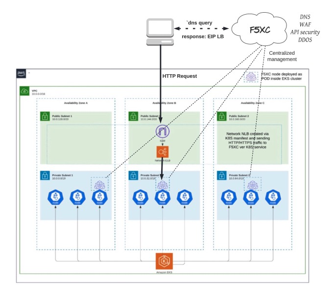

#This repo will allow you to configure the following objects automatically 
using TF:

1. Pool (pointing to member behind CE)
2. LB (local on CE)
3. Generate valid certificate using Let's Encrypt CERTBOT 
4. Publish the DNS pointing to the LB automatically (in my example, AWS 
LB).

the components :

Variables.tf = please change to adjust your env.

HTTP_POOL.tf = create Pool with the reference of your service

GENERATE_CERTIFICATE.tf = generates certificate using CERTBOT (runs BASH script names “script.sh” + “dns_register.sh”)

HTTPS_APP.tf = create LB with the certificate generated before, pointing to the Pool created before.

DNS_Create_Record.tf = create cname pointing from your desired FQDN to the cname created by the system. [we should replace with you public IP]. (runs 
BASH script named “create_cname.sh”)

- [Prerequisites](#Prerequisites)

1. TF, and certificate from XC portal :
please follow the "Generate API Tokens" and "Generate API Certificate"

https://docs.cloud.f5.com/docs/how-to/user-mgmt/credentials

extract the key + certificate :
    openssl pkcs12 -info -in certificate.p12 -out private_key.key -nodes -nocerts
    openssl pkcs12 -info -in certificate.p12 -out certificate.cert -nokeys
    
use them in the variable.tf file

2.CERTBOT :

https://certbot.eff.org/

VESCTL:

https://gitlab.com/volterra.io/vesctl/blob/main/README.md
user .p12 certificate for authentication

$ cat /Users/user1/.vesconfig

server-urls: https://acmecorp.console.ves.volterra.io/api

p12-bundle: /Users/user1/certificate.p12

export VES_P12_PASSWORD=myp12password

jq installed

- [Installation](#installation)
